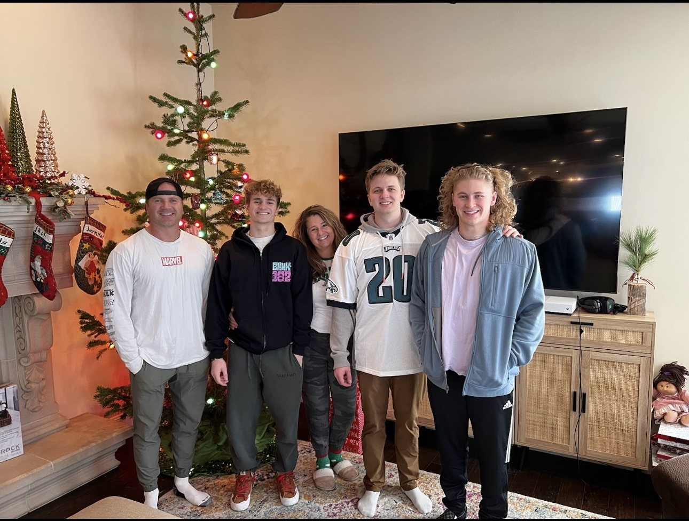
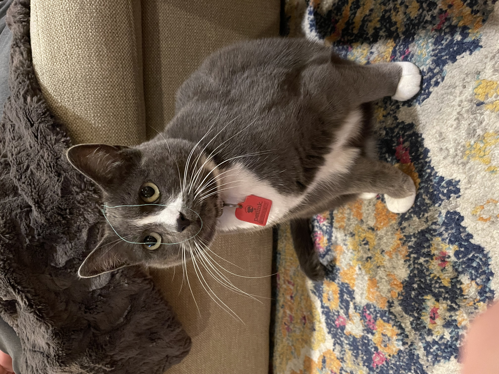
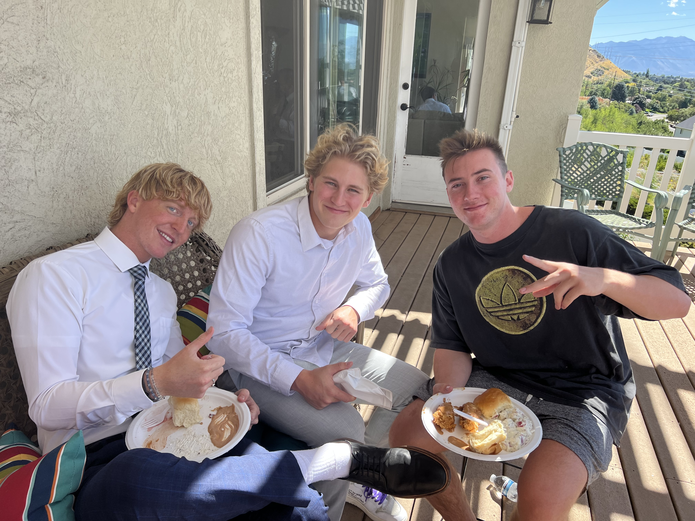

```{r setup, include=FALSE}
knitr::opts_chunk$set(echo = TRUE)
```

# Welcome | [Home](ContactInfo.html)| [About Me](AboutMe.html)| [Resume](Resume.html)| [Project](Project.html)|[New skill](New.html)


## Welcome!

At 24 years old, I am from the sunny shores of Simi Valley, California. I live in Provo, as I pursue my bachelor's degree in biology at Utah Valley University, set to graduate in May 2024. I am driven by a passion for dentistry, with dreams of becoming an orthodontist. Outside academics, you will often find me surfing, painting, or reading. My current adventure is set on moving to Kauai after the summer, where I will work as a dental assistant and part-time lifeguard. 




I sit as the middle child with my older brother [Scott](https://www.instagram.com/kingslayer__1/) who lives in Philadelphia, and a younger brother [Jack](https://www.instagram.com/jack_stringham2/) who lives in American Fork.With my parents Dave and Jennifer. We are also accompanied by an Australian Shepard named Maggie and a cat named Puurfessor Chaos. Surrounded by my two best friends [Gage](https://www.instagram.com/gage.murrray/) and [Joe.](https://www.instagram.com/joeolsenn/) 





