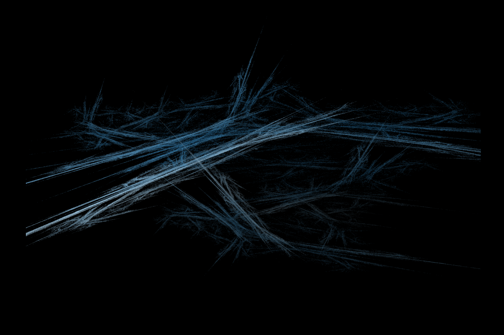
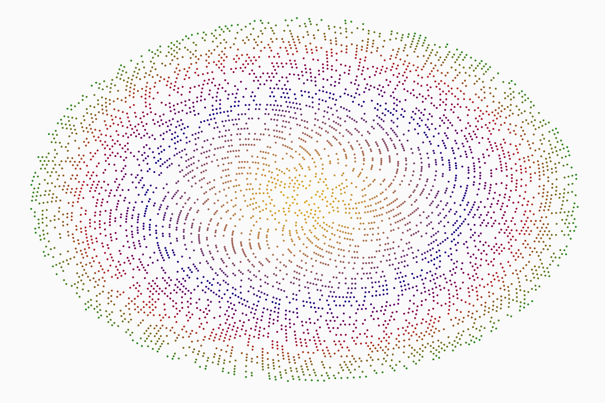

```{r,include=FALSE,warning=FALSE}
library(aRtsy)
library(gifski)
library(ggplot2)
```

# Welcome | [Home](ContactInfo.html)| [About Me](AboutMe.html)| [Resume](Resume.html)| [Project](Project.html)|[New skill](New.html)

[Cool link showing how all of this gets done](https://flam3.com/flame_draves.pdf)

```{r,include=FALSE}
set.seed(2)
flame1 <- canvas_flame(colors=colorPalette("dark2"))
```


```{r,include=FALSE}
set.seed(2)
random2 <- canvas_recaman(colors = colorPalette("random",n=10))
```


```{r,include=FALSE}
set.seed(2)
smoke3 <- canvas_phyllotaxis(colors = colorPalette("tuscany1"))
```


